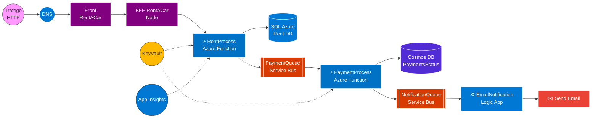

# 🚗 Azure Application - Sistema Cloud Native de Locação de Carros


Projeto focado no desenvolvimento de uma **Arquitetura de Microsserviços Orientada a Eventos (Event-Driven)** 100% Cloud Native, utilizando os recursos do **Microsoft Azure**. O sistema simula o fluxo principal de backend de uma locadora de veículos: desde o tráfego HTTP no frontend, processamento do aluguel, confirmação de pagamento, até a notificação final do cliente.

---

## 🏗️ Arquitetura do Projeto

O diagrama abaixo ilustra o fluxo de dados exato da aplicação, inspirado no desenho arquitetural do projeto. A arquitetura foi desenhada para ser altamente escalável e assíncrona, utilizando mensageria para interligar os domínios.


## ⚙️ Como Funciona o Fluxo Principal

* **Entrada de Dados (Postman):** O fluxo é iniciado através de uma requisição HTTP POST (utilizando o Postman para simular o cliente), enviando o *payload* com os dados da locação diretamente para a API do backend.
* **Processamento de Locação:** A Azure Function `RentProcess` recebe a requisição, salva os dados de negócio do aluguel em um banco de dados relacional SQL Azure e despacha um evento assíncrono para a fila de pagamento.
* **Processamento de Pagamento:** A Azure Function `PaymentProcess` consome a mensagem da fila `PaymentQueue`, processa a transação, atualiza o status em um banco NoSQL Cosmos DB e envia a requisição final para a fila de notificação.
* **Notificação Automática:** O Azure Logic Apps escuta a `NotificationQueue`. Ao receber a mensagem de sucesso, o fluxo de integração visual traduz o JSON e dispara o e-mail de confirmação para o cliente.
* **Segurança e Telemetria:** Segredos de conexão são protegidos no Azure Key Vault e o desempenho é acompanhado pelo Application Insights.

---

## 🛠️ Tecnologias e Serviços Utilizados

* **Azure Functions (.NET 8):** Computação *serverless* executando regras de negócio (`RentProcess` e `PaymentProcess`).
* **Azure SQL Database:** Banco de dados relacional para persistência transacional das locações.
* **Azure Cosmos DB:** Banco de dados não relacional escalável para status de pagamentos.
* **Azure Service Bus:** Barramento de mensageria garantindo o desacoplamento entre os serviços.
* **Azure Logic Apps:** Solução *low-code* para envio automatizado de e-mails.
* **GitHub Actions:** Automação de CI/CD para compilação e deploy.
* **Postman:** Ferramenta utilizada para simular as requisições HTTP e testar as APIs.

---

## 🚧 Desafios Enfrentados e Soluções Técnicas

Durante o desenvolvimento deste projeto, superamos cenários reais de DevOps e arquitetura Cloud:

### 1. Limitações e Contornos no Azure Free Tier
* **Desafio:** Otimizar a arquitetura para rodar com alta disponibilidade sem esgotar os créditos gratuitos de estudante.
* **Solução:** Ajuste fino no *polling interval* (tempo de verificação) do Logic Apps para não consumir execuções ociosas. Provisionamento do Cosmos DB e do SQL Azure em camadas de custo-benefício adequadas ao ambiente de dev/teste.

### 2. Falhas de Diretório no Pipeline CI/CD (MSB1003)
* **Desafio:** O GitHub Actions falhava ao tentar compilar a função com o erro `MSB1003`, pois o *runner* não encontrava o arquivo `.csproj` no repositório.
* **Solução:** Configuração explícita do mapa de diretórios no arquivo YAML utilizando a variável `AZURE_FUNCTIONAPP_PACKAGE_PATH` e o comando *shell* `pushd`. O *build* foi alterado para `dotnet publish` para empacotar corretamente as dependências do SDK do Azure.

### 3. Proteção de Dados Sensíveis (Secret Scanning)
* **Desafio:** Ao exportar o ambiente do Azure via Infraestrutura como Código (ARM Templates) e tentar fazer o *push*, o GitHub bloqueou a ação por violação de segurança (chaves reais expostas no código).
* **Solução:** Sanitização completa do arquivo `template.json`. As *connection strings* reais (como a `SharedAccessKey` do Service Bus) foram substituídas pelo uso seguro do tipo `SecureString` no bloco `parameters`. O histórico sujo do Git foi reescrito via `git reset --soft origin/main` para garantir total conformidade de segurança e anonimização do Tenant ID.

---

## 🚀 Como fazer o Deploy Local

Se desejar replicar este ambiente de estudo, siga os passos abaixo:

1. **Clone este repositório:**
   ```bash
   git clone [https://github.com/ErickGeovane0706/Azure-Aplicacao-Aluguel-de-Carros.git](https://github.com/ErickGeovane0706/Azure-Aplicacao-Aluguel-de-Carros.git)
